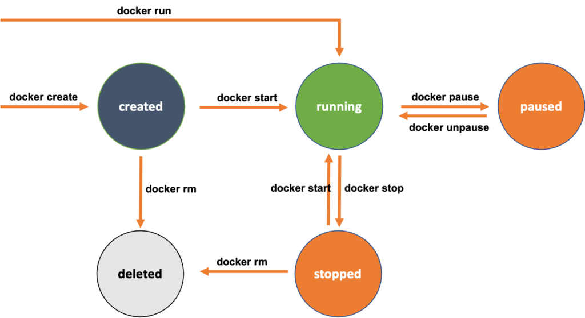

# 🚀Docker Cheat Sheet/CLI Commands🚀

## Basic commands

`docker run "image"`

### Process Status 
1. ps: List of running containers.
2. ps -a:  List of containers(running and stopped)
```cmd
docker ps
docker ps -a
```

3. stop runnig containers
`docker stop "container_id"`
4. remove stoped and exited  container permanently
`docker rm "container_id"`
-- remove all
`docker rm $(docker ps -a)`

5. list of available images
`docker images`
6. Remove an image.
For remove an image we have to stop and remove all dependent containers first.
`docker rmi 'image'`
7. Run in detached mode (run in background)
`docker run -d 'image'``
---

## Managing Docker Services and Sockets with Systemd

Docker service can still be activated through the Docker socket (`docker.socket`) even if you stop the Docker service (`docker.service`). The Docker socket allows communication with the Docker daemon and is used for Docker API access.

1. This command checks the status of the Docker service.
`sudo systemctl status docker`
2. This command stops the Docker service.
`sudo systemctl stop docker`
3. This command checks the status of the Docker service again.
`sudo systemctl status docker`
4. This command stops the Docker socket.
`sudo systemctl stop docker.socket`
5. This command checks the status of the Docker service once again.
`sudo systemctl status docker`
---

## Docker Container Lifecycle

The lifecycle of a Docker container involves creation, running, stopping, and removal. Containers are created from Docker images, run as isolated instances, can be stopped or paused, and can be removed when no longer needed.



1. docker create:
Purpose: Creates a new container but does not start it.
Example:
Creates a new container named "my-container" using the Nginx image but does not start it.
`docker create --name my-container nginx`

2. docker start:
Purpose: Starts one or more stopped containers.
Example:
Starts the container named "my-container" that was previously created but stopped.
`docker start my-container`

3. docker run:
Purpose: Creates and starts a new container in a single command.
Example:
This command combines the process of creating and starting a container named "my-container" using the Nginx image in a single step.
`docker run --name my-container nginx`

4. docker pause:
Purpose: Temporarily pause the processes in the running container.
Example:
    ```bash
    docker pause my-container
    docker ps --filter "name=my-container"
    docker unpause my-container
    docker ps --filter "name=my-container"
    ```
5. docker rm:
Purpose: The docker rm command is used to remove a container.
Example:
Want to remove container named "my-container".
`docker rm my-container`

6. Run command inside container in interactive mode
`docker exec -it 'container_id' bash`
7. Run a command inside a running container.
`docker exec container_name ls /usr/share/nginx/html`
8. Display detailed information about a container.
`docker inspect container_name`
9. Stop a running container via name or ID.
`docker stop container_name`
10. Stop all running container.
`docker stop $(docker ps -q)`
11. Show only **id** of running containers.
`docker ps -q`
12. Restart a container.
`docker restart 24952546f818`
13. Restart after 30 second.
`docker restart -t 30 6d144a1d546b` 
14. Remove a stopped container.
`docker rm 24952546f818`
15. Remove multiple containers.
`docker rm 24952546f818 6d144a1d546b`
16. Temporary pause a Docker container.
`docker pause  24952546f818`
17. Unpause a Container.
`docker unpause 24952546f818`

## Container Naming and Identification:
Run a container with Name.
`docker run --name test-nginx nginx`
Rename a container.
`docker rename test-nginx test-rename-nginx`
Get the container ID by its name.
`docker inspect --format='{{.Id}}' container-name`

## Container Logs and Stats:
Display the logs of a container.
`docker logs <containerID>`

Display a live stream of container resource usage statistics.
`docker stats <containerID>`

## Container Interaction:
Copy from container to host.
`docker cp <container_id_or_name>:<container_path> <host_path>`
Copy from host to container.
`docker cp <host_path> <container_id_or_name>:<container_path>`

Attach to a running container (not recommended for long-term use).\
`docker attach <containerID>`
Inspecting Container Information.
`docker inspect <container_id_or_name>`

Remove all stopped containers.
`docker container prune`

Run an Interactive Terminal (Container Remains Running).
`docker run -it busybox`
keep the container running for 3600 seconds (1 hour), and then it will exit.
`docker run busybox sleep 3600`

***NB: Many of this part are taken from*** 
**Md Nasir Uddin**
https://github.com/nasirnjs
